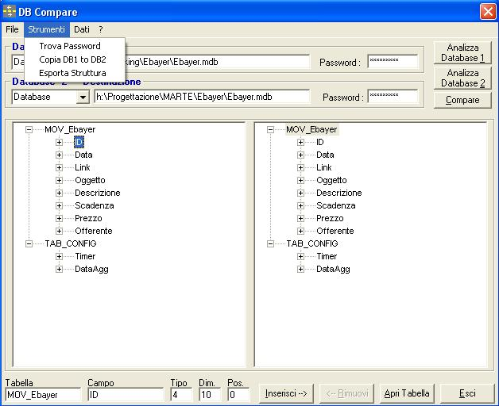



## DBCompare

### Description

Open Access Database, Analize structure, Compare 2 Database and select updates, Open table, copy data from database 1 to database 2, Find database password, type and lenght of fields, copy fields or table from database 1 to database 2, ecc.
 
### More Info
 
Open only database access.

             |
---                |---
**Submitted On**   |2006-02-21 13:33:36
**By**             |[Ciarmiello Martino](https://github.com/Planet-Source-Code/PSCIndex/blob/master/ByAuthor/ciarmiello-martino.md)
**Level**          |Advanced
**User Rating**    |5.0 (10 globes from 2 users)
**Compatibility**  |VB 6\.0
**Category**       |[Complete Applications](https://github.com/Planet-Source-Code/PSCIndex/blob/master/ByCategory/complete-applications__1-27.md)
**World**          |[Visual Basic](https://github.com/Planet-Source-Code/PSCIndex/blob/master/ByWorld/visual-basic.md)
**Archive File**   |[DBCompare1995015182006\.zip](https://github.com/Planet-Source-Code/ciarmiello-martino-dbcompare__1-65380/archive/master.zip)

